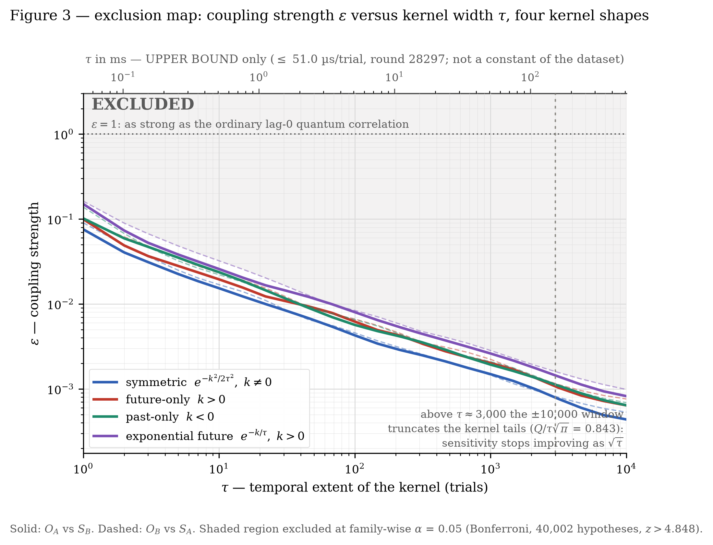

# cross-trial-bell-bound

An empirical bound on **cross-trial dependence** in a loophole-free Bell test:
does the setting choice of one trial leave any trace in the outcome of a
*different* trial? Public data: ten CURBy beacon rounds of 15,000,000 trials
each, spanning twenty-two months of the archive.

Standard quantum mechanics predicts a strong correlation at lag 0 and exactly
nothing at any other lag. Retrocausal and superdeterministic models that
relax *measurement independence* generically predict a small non-zero signal
that spreads over neighbouring trials. This repository measures how large such
a signal could be without having been seen.

## Paper

**Bounding cross-trial temporal coupling in a loophole-free Bell test** —
[`paper/georgitzikis_2026_cross_trial_bell_bound.pdf`](paper/georgitzikis_2026_cross_trial_bell_bound.pdf) (LaTeX source bundle for arXiv in
[`paper/arxiv/`](paper/arxiv/); the arXiv identifier will be added here once
the posting is announced).

**Christos Georgitzikis** · Independent Researcher ·
<georgitzikis@me.com> ·
[ORCID 0009-0009-5764-0600](https://orcid.org/0009-0009-5764-0600)

## Result

- **Settings → outcomes.** Mutual information I(O_A(i); S_B(i+k)) < **1.13 × 10⁻⁶**
  bits/trial for every |k| ≤ 10,000; 0/20,001 lags above threshold (largest
  observed 7.11 × 10⁻⁷ at k = −9,992, p = 1.2 × 10⁻⁴ against a Bonferroni
  threshold of 1.25 × 10⁻⁶).
- **Outcomes → outcomes.** I(O_A(i); O_B(i+k)) < **1.066 × 10⁻⁶** bits/trial for
  every 0 < |k| ≤ 10,000 — below **1/13,384** of the Bell correlation the same
  analysis measures at k = 0 (1.4267 × 10⁻², G = 296,670), which is the positive
  control.
- **Exclusion map.** For the model p(i) = p₀(S_own(i)) + α·ε·Σ_{k≠0} W(k)·S_other(i+k)
  — p(i) being the observable click probability, not a hidden variable, and the
  same-trial term k = 0 excluded from every kernel — the coupling
  is bounded by **ε < 7.6 × 10⁻²** at τ = 1 trial and **ε < 4.4 × 10⁻⁴** at
  τ = 10,000 (O_A vs S_B), at family-wise α = 0.05, where ε = 1 is the strength
  of the ordinary lag-0 quantum correlation. It was measured
  for symmetric, future-only (retrocausal), past-only and one-sided exponential
  kernels; the worst case over all four and both channels is 1.62 × 10⁻¹.
  Within that tested class (4 families × 26 widths) the sensitivity follows an
  approximately universal 1/√Q scaling with Q = Σ W(k)² — an empirical
  regularity, not a theorem; the rigorous exclusion is for the four families.
- **All ten pulses combined.** Each pulse analysed on its own terms and joined
  by inverse-variance weights: **ε < 1.9 × 10⁻²** at τ = 1 and
  **ε < 1.2 × 10⁻⁴** at τ = 10,000 — a mean factor 3.6 over the single pulse.
  The ten per-pulse couplings are statistically homogeneous (χ²(9) test) and
  the pulses are uncorrelated (max |r| = 0.018 over 90 pulse pairs), so the
  weights are justified by measurement.
- **Null side-checks, all ten pulses.** No single-party memory
  (0/400,000 tests), no dependence on the parity of adjacent setting pairs
  (0/400,020), no outcome–outcome structure at nonzero lag (0/200,000), and
  no setting–setting correlation between the wings (0/400,020).

Every bound is verified by injecting a signal of known (ε, τ) into the real
data and recovering it, and every threshold is checked against an empirical
null built from shuffled settings.



## Data

The raw data is the CURBy quantum randomness beacon (NIST / University of
Colorado Boulder), which publishes the full record of every Bell trial:

- <https://random.colorado.edu>
- Rounds used: **28297** (primary map, 2025-08-22) plus 1000, 15000, 22000,
  23000, 26000 and 28293–28296 — ten in all, 2023-10-31 to 2025-08-22; each
  cut at the stopping criterion of 15,000,000 trials.
- The `.bin` rounds are ~9 MB each and are **not** included in this repository.
  `results/curby_manifest.json` records the exact URLs, byte counts and SHA-256
  of every round downloaded, so the input can be verified bit for bit.

## Reproducing

```bash
pip install -r requirements.txt
cd code

# 1. download one raw round (rate-limited, hard cap of 5 files per run)
python3 katevasma.py --rounds 28297

# 2. unpack it into SA / SB / OA / OB arrays
python3 load_curby.py curby_round_28297.bin --out curby_28297.npz

# 3. main analyses (each reads curby_28297.npz from the same directory)
python3 full_scan.py                 # ±10,000 lag scan, settings vs outcomes
python3 meros1_alpha.py              # calibrate α (the ε = 1 convention)
python3 meros2_injection.py          # injection test of the analytic relation
python3 meros3_map.py                # matched filter, symmetric exclusion map
python3 meros3_verify.py             # inject at ε_excl, ε_excl/2, 2·ε_excl
python3 meros4_outcome_outcome.py    # outcome–outcome scan + k = 0 control
python3 meros5_asym.py               # asymmetric kernels (future / past / exp)
python3 meros5_verify.py             # injection test for the asymmetric filters

# 4. audit (numbers quoted in §3, §6.3 and §7 of the paper)
python3 meros6_p0.py                 # p₀ as a marginal; exact vs expanded MI
python3 meros6_kernelQ.py            # ε ∝ 1/√Q and the Q → ε_excl table
python3 meros6_systematic.py         # where the 3–7% systematic comes from
python3 meros6_alpha10.py            # α for each of the ten pulses

# 5. ten-pulse extensions (need the other nine rounds in dedomena_curby/)
python3 meros7_power.py              # the ε = 0 and ε_excl/2 power levels
python3 meros8_settings.py           # setting correlations, phantom signal
python3 meros9_joint.py              # inverse-variance joint bound
python3 meros10_settings10.py        # phantom check across all ten
python3 meros11_optimality.py        # Gaussianity of δ̂, kernel mismatch
python3 meros12_selfmemory.py        # single-party memory scan
python3 meros13_parity.py            # setting-pair parity scan
python3 meros14_oo10.py              # outcome–outcome scan, all ten
python3 meros15_homogeneity.py       # ε homogeneity; matched-threshold cost
python3 meros16_crosspulse.py        # cross-pulse correlation of δ̂(k)

# 6. figures (Figures 1–4 of the paper, English, PDF + PNG)
python3 figures_en.py
```

Runtime: the lag scans are FFT-based and take seconds; the empirical nulls
(400–2,000 shuffles) take a few minutes each on a laptop. Every script writes
a `.json` with full numbers and a `.txt` transcript — the ones in `results/`
are exactly what the paper quotes.

## Layout

```
paper/      paper_en.md (source), georgitzikis_2026_cross_trial_bell_bound.pdf,
            arxiv/ (submission bundle)
code/       all analysis scripts, flat; scripts import each other by name
results/    .json / .txt / .log output of every run, plus .npz curve dumps
figures/    fig1–fig4 of the paper (.pdf vector + .png)
```

Script names are transliterated Greek (`meros` = part, `xartis` = map,
`katevasma` = download, `epalitheusi` = verification); the docstring at the
top of each file explains what it does and, more importantly, what it refuses
to assume.

| script | what it does |
|---|---|
| `katevasma.py`, `epalitheusi.py`, `xartografisi.py` | download, verify and map CURBy rounds |
| `load_curby.py`, `compress_sa.py` | unpack the beacon format; settings-entropy check |
| `full_scan.py`, `lag_test.py`, `lag_dense.py`, `lag_limit.py` | lag scans and their thresholds |
| `j_curve.py`, `stability.py`, `stability10.py` | Bell parameter per round; stability across 10 rounds |
| `meros1_alpha.py` … `meros5_plot.py` | calibration, injection, exclusion maps, asymmetric kernels |
| `meros6_p0.py`, `meros6_systematic.py`, `meros6_kernelQ.py`, `meros6_alpha10.py` | audit: p₀ as a marginal, the σ_T systematic, ε ∝ 1/√Q, α across ten pulses |
| `meros7_power.py` … `meros11_optimality.py` | power curve, phantom signal, joint bound, optimality checks |
| `meros12_selfmemory.py`, `meros13_parity.py`, `meros14_oo10.py`, `meros15_homogeneity.py`, `meros16_crosspulse.py` | ten-pulse null scans: own-setting memory, pair parity, outcome–outcome, ε homogeneity, pulse independence |
| `build_paper_pdf.py`, `check_refs.py`, `check_tables.py` | build the PDF from markdown; verify cross-references and table layout |
| `figures_en.py` | Figures 1–4 of the paper (English, vector PDF + PNG) |
| `diagnostiko_syssomatosis.py`, `null_matched.py`, `drift_check.py`, `scratch_test.py` | null diagnostics and matched-bias controls |
| `data_gen.py`, `power.py`, `power_curve.py`, `power_refine.py`, `scaling.py` | simulator data and power curves |
| `collect_ibm.py`, `analyse_raw.py` | independent IBM Quantum hardware null test (optional) |

## Licence

MIT — see [LICENSE](LICENSE).
