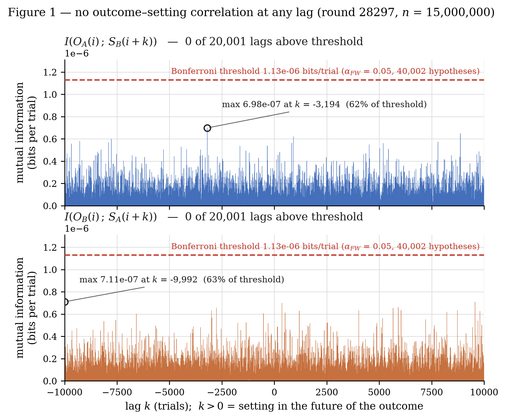
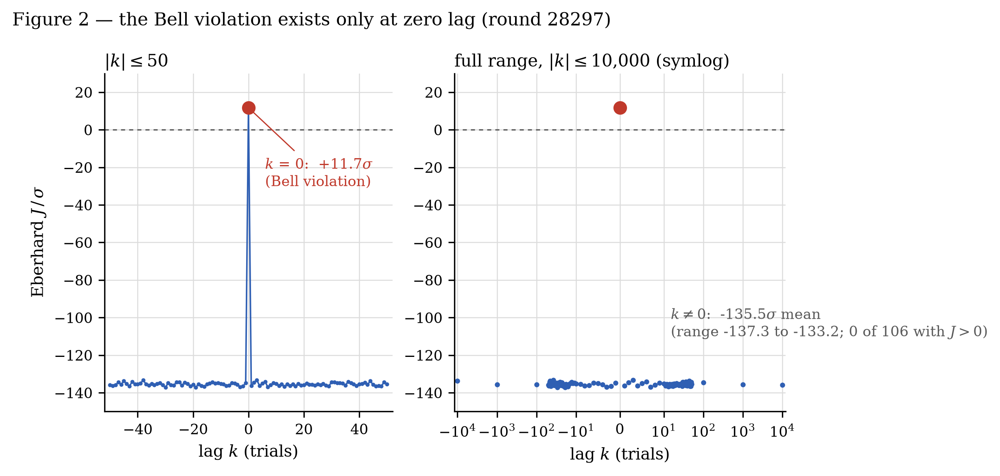
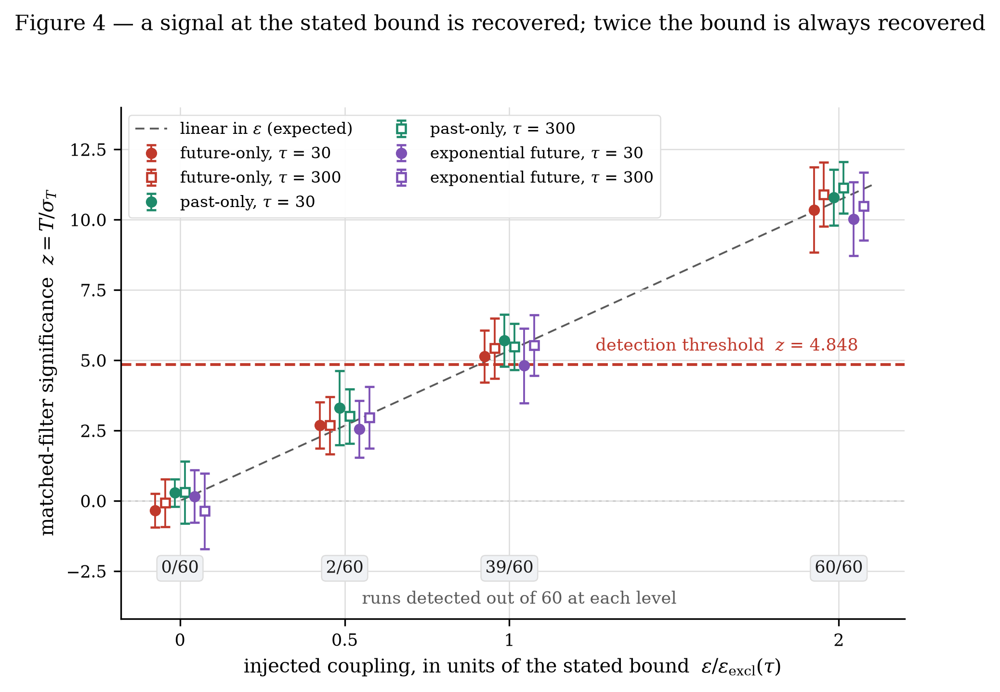

# Bounding cross-trial temporal coupling in a loophole-free Bell test

**Christos Georgitzikis**
*Independent Researcher*

---

## Abstract

Bell's theorem admits one loophole that no experiment can close in principle:
measurement independence. Retrocausal and time-symmetric models exploit this
opening, but the class of models in which the click probability at one trial
depends on measurement settings at *other* trials has been formalised
theoretically but never given an experimental bound. We bound it on public raw
records from the CURBy device-independent randomness beacon — ten pulses of
1.5 × 10⁷ trials each, spanning twenty-two months, analysed separately and
never spliced.

The result that depends on no model is a bound in bits. Scanning every lag
|k| ≤ 10,000 between one party's outcome and the other party's setting,

I(O ; S at lag k) < 1.13 × 10⁻⁶ bits per trial,

at family-wise α = 0.05 (Bonferroni, 40,002 hypotheses). This is 1/362 of the
same-trial outcome–setting information measured on the same records, and the
outcome–outcome information at nonzero lag is bounded below 1/13,384 of the
Bell correlation at k = 0. As a guessing advantage, no outcome lets an
adversary predict any other trial's setting with a bias above 1.25 × 10⁻³.

Translated into the parameters of an explicit model — a click probability
shifted by a kernel-weighted sum of other trials' settings, with kernel width
τ and coupling strength ε — the same data exclude ε above 7.6 × 10⁻² at τ = 1
trial and 4.4 × 10⁻⁴ at τ = 10⁴ trials on a single pulse, for symmetric,
future-only, past-only and one-sided exponential kernels: 208 tests, zero
detections. This map is model-dependent by construction; it is the bound
above re-expressed in the units of one model class, and within the tested
class the sensitivity follows an approximately universal 1/√Q scaling with
Q = Σ W(k)², the rigorous exclusion being stated for the four explicit
families. Combining the ten pulses by inverse-variance weights, with the
pulses shown to be uncorrelated, the excluded coupling falls to 1.9 × 10⁻² and
1.2 × 10⁻⁴ at the same two widths: the strongest statement these data
support, quoted alongside the single-pulse map rather than in its place.

The absence of cross-trial memory that device-independent randomness and
DI-QKD assume is thereby checked empirically on an operating beacon, at the
stated sensitivity. The result is null. Its value is that the region is now
mapped rather than assumed empty.

---

## 1. Introduction

Bell's theorem rests on locality, realism, and measurement independence — the
assumption that the settings chosen by the experimenters are statistically
independent of whatever variables determine the outcomes. Loophole-free
experiments [1,2,3] have closed the locality and detection loopholes.
Measurement independence cannot be closed by experiment even in principle, since
any test of it must presuppose that some choices are free [4,8].

It can nevertheless be *bounded*, and bounding it is not a philosophical
exercise. Hall [4] showed that only a small relaxation of measurement
independence suffices for a local model to reproduce quantum correlations, which
makes the permitted size of the relaxation a physically meaningful quantity.
Retrocausal programmes [5,6,7] remain the principal route to a local account of
Bell correlations, and are unexcluded by any experiment to date.

Two quantities must be kept apart. Hall's measure [4] is I(X,Y : Λ), the mutual
information between the settings and the hidden variable, and it admits no
experimental upper bound in a standard Bell test [8]: Λ is by construction
unobservable, and a model may place arbitrary correlation there. What we bound
is I(O ; S) at nonzero lag, between two recorded quantities.

The two are related by the data-processing inequality in one direction only.
Since the outcome is generated from λ, I(O(i) ; S(i+k)) ≤ I(λ(i) ; S(i+k)); a
small observed value does not force a small hidden one. The converse fails, and
we do not claim it. The bound constrains models by their observable consequences,
which is the only handle an experiment has, and is sufficient for the purpose:
measurement dependence that produces no observable signature in the measured
outcome statistics is not constrained by this analysis.

The retrocausal models cited above are almost exclusively *within-trial*:
the outcome depends on the setting of the same measurement, chosen slightly
later in time. This note addresses a different class — models in which the
dependence extends *across* trials, so that the click probability at trial *i*
is influenced by settings at trials i ± k. Such models predict a directly
observable signature: nonzero mutual information between an outcome and a
setting separated in the trial sequence.

In the standard taxonomy of loopholes [25] the assumption at issue here is
neither locality nor detection but the freedom-of-choice assumption, and
specifically its cross-trial part: not whether a setting is correlated with the
hidden variable of its own trial, but whether it is correlated with the outcome
of another.

We are not aware of a direct experimental test of this class. The nearest
neighbours are the memory loophole [10], where cross-trial dependence is
admitted and handled by adversarially valid statistics rather than measured, and
the theoretical treatment of measurement dependence across runs by Pope and Kay
[14], which supplies no experimental limit. Published bounds on measurement
dependence — the measurement-dependent locality parameter of Pütz et al. [15],
bounded experimentally by Aktas et al. [16], and the spacetime-region bounds of
the cosmic Bell tests [17,18] — are within-trial and in a different
parametrisation, and are not directly comparable to ε. No published limit known
to us constrains outcome–setting correlation as a function of trial separation.

Santos [26] asks a related question about the same physical effect and answers
the opposite half of it. He shows that memory effects in photon-pair
experiments cannot produce a loophole large enough to rescue local hidden
variables — a statement about what memory could *accomplish*. What follows is a
measurement of how much of it is *there*. Neither implies the other: a device
could carry cross-trial memory far too weak to fake a Bell violation and still
leak more than a protocol assuming none would tolerate. It is that quantity,
at every separation up to ten thousand trials, that is measured here.

The nearest currency to ours is the one measured in bits. Barrett and Gisin
[22] showed that if Bob's choices are completely free, every correlation
obtainable from projective measurements on a singlet can be reproduced by a
local model in which the mutual information between Alice's choice and the
local variables is at most one bit — so a bound in bits on setting–variable
correlation is the natural currency for how much measurement dependence a
model needs. Hall and Branciard [23] sharpened the accounting in the CHSH
scenario, finding that an optimal causal model needs about 0.080 bits of such
information to reproduce the maximal quantum violation while a retrocausal
one, in which later settings influence earlier source variables, needs about
0.046. Koh et al. [24] carried the same relaxation into device-independent
randomness expansion and bounded what an adversary gains from it. All three
quantify information involving the hidden variable, at a single trial; the
bound below is on information between two recorded quantities, at a
separation in trials, and the data-processing inequality relates the two in
one direction only (above). It cannot be compared with them numerically, and
we do not.

---

## 2. The model class

**Notation.** A *trial* is one entry of the beacon record. A *pulse* is one
beacon round; the two words are used interchangeably below and rounds are
identified by their beacon index. For trial *i*, S_A(i), S_B(i) ∈ {1, 2} are
the two parties' setting choices and O_A(i), O_B(i) ∈ {0, 1} are their
outcomes, 1 = detector click. Where the party is immaterial we write S and O.
For the coupling term settings are encoded as S(i) ∈ {−1, +1}. The symbol *k*
always denotes a lag in trials, never a count. The symbol λ denotes the hidden
variable of the models under discussion; it is never a measured quantity in this
work.

Measurement independence in its usual form asserts that the click probability at
trial *i* is independent of all settings other than the local one at that trial.
We relax this in a specific, parametrised way. Writing p(i) for the click
probability at trial *i*:

> **p(i) = p₀(S_own(i)) + α · ε · Σ_k W_τ(k) · S_other(i+k)**

Here p₀(S_own) is the ordinary same-trial click probability given the party's
own setting — standard quantum mechanics, measured directly — and W_τ is a
kernel of characteristic width τ normalised to max W = 1. Two parameters carry
the physics:

- **ε** — coupling strength. We adopt the normalisation ε = 1 ≡ as strong as the
  ordinary quantum-mechanical same-trial connection, so that ε is directly
  interpretable as a fraction of standard physics. This is a convention, not a
  physical statement. The factor α that implements it is defined in §3.
- **τ** — temporal extent, in trials. This is the parameter that gives the scan
  range physical meaning: without it, the choice of |k| ≤ 10,000 would be
  arbitrary. §4.1 converts trials to seconds.

The scan range itself is not arbitrary either. Statistically it is almost free:
a lag k is estimated from n − |k| trials, so at the edge of the window the
sample is still 99.93% of the total and the loss of power is 0.03%; the sample
would shrink by 10% only near |k| ≈ 1.5 × 10⁶, where the loss of power would
still be just 5%. In physical units the window is not a single number: at the
instrument's nominal rate of about 250,000 trials per second (§4.1) it spans
≈ 40 ms, and the metadata bound of 51 µs per trial puts it at ≤ 510 ms. Only
the shorter end can be assumed, so the coverage claim is made against 40 ms:
electronic and fast mechanical correlation times of a table-top optical
apparatus fall inside it, and anything slower — thermal drift of an optical
table, which lives on seconds to minutes — does not. Slower mechanisms are not
thereby unconstrained; they would appear as drift common to whole pulses rather
than as structure in k, and are addressed by the setting-correlation test of
§5.1 and by the ten-pulse comparison of §6.4, which spans twenty-two months.

Equation (1) is a linearisation, and holds while the perturbation is small
against the baseline rate. Since the settings are independent and equiprobable,
the injected term has standard deviation α ε √Q across trials, so the condition
is α ε √Q ≪ p₀. The largest value of α ε √Q anywhere on the single-pulse map
occurs for the past-only kernel at τ = 1 in the channel O_B vs S_A, where
ε_excl = 1.382 × 10⁻¹ and Q = 0.386; with α_B = 1.8283 × 10⁻³ this is
1.570 × 10⁻⁴, or 2.3% of that channel's p₀ = 6.87087 × 10⁻³. Everywhere else
it is smaller.
The model is therefore used only in the regime where its linear form is
accurate.

### 2.1 Why cross-trial coupling is a class worth testing

The model above is not introduced arbitrarily. Two established lines of work
define hidden-variable classes with exactly this structure, and neither has been
given an experimental bound as a function of separation.

**The memory loophole.** Barrett, Collins, Hardy, Kent and Popescu [10] observed
that in a repeated Bell experiment the hidden variables of one trial may depend
on the settings and outcomes of *previous* trials, since a real source and real
detectors carry state between runs; the same reuse of stateful devices is what
makes memory attacks possible in device-independent cryptography [19]. The loophole is normally addressed
statistically, by deriving p-values valid without the i.i.d. assumption
[11,12,13]. That approach establishes that a violation remains significant under
adversarial memory; it does not measure how much memory is actually present. The
present work asks the complementary question: given the data, how large could
such a dependence be?

**Measurement dependence across runs.** Pope and Kay [14] formalised limited
measurement dependence in multiple runs of a Bell test, treating the settings of
one run as partially determined by variables shared with others. Their treatment
is theoretical; it supplies no experimental limit. Our ε is a direct operational
analogue of the quantity their framework leaves unconstrained.

Beyond these, three mechanisms would produce the signature we search for:

1. *Source memory.* A hidden variable retaining state across trials couples
   λ(i) to conditions at neighbouring trials, including the settings applied
   there. The natural kernel width τ is then the correlation time of the source
   state in units of trials.

2. *Non-Markovian environment.* If the two wings share an environment with
   memory, the effective hidden variable at trial *i* is a functional of a window
   of the environment's history rather than of its instantaneous state.

3. *Temporally extended boundary conditions.* Retrocausal accounts [5,6,7] fix
   the hidden variable using a future boundary condition, and it matters what
   that condition is a condition *on*. In the terminology of [6] the settings
   are inputs to the model and the outcomes are outputs; such models are better
   called future-input dependent, and what they give up is λ-independence — the
   requirement that the distribution of λ be independent of the settings a and
   b that lie in its future. The future-dependence is therefore on the
   *setting*, a parameter fixed from outside the model. The outcome is not a
   second future condition; it is the thing the model is built to explain. What
   the scan of §3 measures is exactly the first quantity: δ(k) is the
   dependence of an outcome at trial *i* on the *setting* at trial *i+k*.
   Outcome–outcome dependence is a different object, bounded separately in
   §6.5, and is not what a future-input dependent account calls for.

   Such accounts are normally posed within a single trial, the relevant future
   input being the setting of the same measurement, and the condition is then
   imposed on an instantaneous hypersurface. That last step is the fragile one.
   In the two-boundary field models the weight from which probabilities are
   built is a flux integral of the field's four-current over a *closed*
   hypersurface in spacetime [20], and restricting that surface to two parallel
   instants is presented as a special case to be relaxed rather than as a
   requirement [21]. A duration enters those models explicitly: the predictions
   depend on the interval t₀ between the two boundaries, they depart from
   standard quantum mechanics if either boundary constrains the energy — a
   conserved quantity — to a precision near ħ/t₀, and two measurements cannot
   be placed in a well-defined order at a separation shorter than the time a
   measurement itself takes [20].

   Our own reading of this, offered as an observation and not as anyone's
   stated position, is that the durationless instant is the part that does not
   survive. A future condition posed physically is carried by something that
   persists over an interval, so the "moment of measurement" acquires a finite
   extent, and a constraint of finite extent reaches neighbouring trials. τ is
   that extent, in units of trials, and the future-only kernels of §2.2 are its
   natural form.

   The formalisation of this picture remains open. We know of no model that
   derives a cross-trial kernel W(k) from a two-boundary or future-input
   dependent starting point, and we do not supply one. The bound does not
   require it: the only property of the kernel that enters the exclusion is
   Q(τ) = Σ_k W(k)² (§2.2, §6.3), so whatever form the formalisation takes, its
   coupling is bounded by the tables of §6.3 as soon as its W is evaluated on
   the same lag grid.

A fourth possibility is mundane and worth stating, because the test excludes it
too: correlated drift between the setting generators and the detector state
would produce cross-trial outcome–setting correlation with no new physics
whatsoever. A null result is therefore also a systematics check on the
experiment, independent of any interpretation.

**What is bounded is a rate, not a hidden variable.** We model the click
probability p(i), an observable, and bound the mutual information between two
observables. This is deliberate and is the reason the bound exists at all. A
dependence residing entirely in an unobservable λ, leaving no trace in the
outcome statistics, is not constrained here — but neither does it do any work: a
measurement dependence that never reaches the outcomes cannot help a local model
reproduce quantum correlations. What we bound is the operationally effective
part.

### 2.2 Kernels

Four kernels are considered. In every one of them the lag k = 0 is excluded:
W_τ(0) = 0 by definition. The k = 0 term would be the dependence of an outcome on
the setting of the *same* trial — the no-signalling condition, a different
physical question from cross-trial coupling, already tested separately in the
"Cross-pair I at k = 0" row of Table 3 (§5). A model class named cross-trial
must not contain the within-trial term, and the matched filter of §6.3 must not
integrate over it. Every kernel, Q, and filter in this paper is therefore
evaluated over 0 < |k| ≤ 10,000.^[An earlier version of this analysis included
k = 0 in the symmetric kernel. Removing it changes the symmetric bounds at
small τ only — by a factor of 1.7 at τ = 1, 3–7% at τ = 10, about 1% at
τ = 100 and below 0.5% for τ ≥ 1,000 — and leaves the one-sided kernels, which never contained k = 0,
unchanged.]

The quantity

> **Q(τ) = Σ_k W_τ(k)², summed over the scan window 0 < |k| ≤ 10,000**

is the only property of the kernel that enters the final bound (§6.3), so it is
tabulated here alongside each shape:

| Kernel | W(k) | Q(τ)/Q_sym, τ ≥ 10 | at τ = 1 |
|---|---|---|---|
| symmetric | exp(−k²/2τ²), all k ≠ 0 | 1 | 1 |
| future-only | exp(−k²/2τ²) for k > 0, else 0 | 0.500 | 0.500 |
| past-only | exp(−k²/2τ²) for k < 0, else 0 | 0.500 | 0.500 |
| exponential future | exp(−k/τ) for k > 0, else 0 | ≈ 0.28 | 0.203 |

: The four kernel shapes and their Q relative to the symmetric kernel.

With k = 0 absent from all four, the one-sided Gaussians carry exactly half the
symmetric Q at every τ, to machine precision. The exponential ratio is not a
constant: for τ ≳ 10 it lies between 0.270 and 0.289 (0.270 at τ = 10, 0.281 at
τ = 100, 0.282 at τ = 1,000, 0.289 at τ = 10⁴, where the window truncates the
two kernels differently), which is why the column is given as ≈ 0.28. Q is computed exactly as a
finite sum over the scan window, never asymptotically; the symmetric kernel
has Q = 0.773 at τ = 1 and 2.545 at τ = 2. One detail of the discrete lag grid:
since k = 0 is excluded, every kernel peaks at k = ±1, where W is exp(−1/2τ²) or
exp(−1/τ) rather than exactly 1 — 0.61 and 0.37 at τ = 1, within 1% of 1 for
τ ≥ 10. The analysis uses these W as written. At small τ the quoted ε is
therefore expressed in units of this sub-unity peak; restated in strictly
peak-normalised units the excluded coupling would be *smaller* by the same
factor, so the tables err on the conservative side.

The one-sided kernels matter because retrocausal models are future-input
dependent [6] and therefore asymmetric; a symmetric-only analysis would leave
the natural case untested. The sign convention is k > 0 ≡ future: the setting at
trial i+k influences the outcome at trial i.

A consequence of excluding k = 0 deserves note. None of the four filters
touches the single lag that carries genuine quantum correlation and known
systematics; the nearest lags, k = ±1, are where detector deadtime would
appear, and Table 3 shows it does not at this sample size. What the filters
integrate is cross-trial structure only.

---

## 3. Observable signature

Write p₀ for the baseline click probability and δ(k) for half the difference in
click rate between the two settings at lag k. The model of §2 gives

**δ(k) = α · ε · W_τ(k)**

where α is the device sensitivity. For small δ, standard expansion of the mutual
information about independence yields

**I(k) ≈ δ(k)² / (2 ln2 · p₀(1−p₀)) = C · ε² · W_τ(k)²,  C = α²/(2 ln2 · p₀(1−p₀))**

For the Gaussian kernel this is a bell curve of width τ/√2 in I and τ in δ.

Here p₀ is the *marginal* click probability of the 2×2 table, p₀ = (c₁+c₂)/n
with c_s the click count under setting s and n the number of trials — not an
average taken as an approximation. Because the settings are balanced 50/50 this
coincides with (r₁+r₂)/2 to within 4.9 × 10⁻⁵ relative, the residual being
(m₁−m₂)(r₁−r₂)/2n with m_s the number of trials under setting s and r_s = c_s/m_s.
The marginal is the expansion point at which the second-order form is exact to
leading order; the alternative choices r₁, r₂, or √(r₁r₂) would give ratios of
1.37, 0.77, and 1.03 against the measured value, whereas the marginal gives
0.986.

**Calibration.** α is not a free parameter. It is fixed by the measured
same-pair lag-0 dependence, which is ordinary quantum mechanics. On round 28297
the two settings give click rates r₁ = 4.96662 × 10⁻³ and r₂ = 8.89072 × 10⁻³,
hence δ(0) = 1.96206 × 10⁻³ ± 2.14 × 10⁻⁵ and α = 1.9621 × 10⁻³ ± 1.1%. The
same construction on Bob's wing gives r₁ = 5.04249 × 10⁻³,
r₂ = 8.69908 × 10⁻³ and α_B = 1.8283 × 10⁻³, with marginal click probabilities
p₀ = 6.92833 × 10⁻³ for Alice and 6.87087 × 10⁻³ for Bob. Both are needed: the
map is computed per channel, and every quantity quoted for O_B vs S_A — the
dashed curves of Figure 3, the joint bounds of Table 7, and the worst point of
the map — uses α_B, not α_A.

The second-order approximation reproduces the exactly computed mutual
information to 1.35% (4.036 × 10⁻⁴ against 4.091 × 10⁻⁴, the latter from the
four-term p log p sum with no expansion). The relevant small parameter is not p₀
but δ/p₀ = 0.28. The prediction is low, hence conservative. This gives
C = 4.036 × 10⁻⁴ bits per trial per ε².

**The exclusion map does not use this approximation.** The bound of §6.3 is
built from ε̂ = T/(αQ) with T = Σ W(k) δ̂(k) from measured click rates,
α = δ(0) = (r₂−r₁)/2, and Q = Σ W(k)² purely geometric. None of these contains
p₀ or any expansion. Reconstructing the map from these raw quantities and
comparing against the published values at 208 points gives a maximum relative
difference of 2.2 × 10⁻¹⁶. The approximation enters only the model-independent
bound of §6.1 and the translation constant C.

The two settings differ in click rate by a factor 1.79, an intentional asymmetry
of the Eberhard configuration [9]. The resulting large α works in our favour:
since ε_excl ∝ 1/α, a device sensitive to its settings yields a tight bound on ε.

**Verification.** The derivation was tested rather than assumed. Synthetic
coupling of known (ε, τ) was injected into the real data — real settings
retained, so that the true setting autocorrelation is preserved — and the
resulting I(k) compared against prediction. Across τ = 1, 10, 100, 1000 and
three ε each, mean ratios were 1.012 (δ amplitude), 1.002 (δ width), and 1.005
(I width against the predicted τ/√2), the fits taken over k ≠ 0 since the
kernel has no k = 0 term (§2.2). An ε = 0 control was run before each τ and
produced a flat curve in every case. Injected probabilities are clipped to
[0,1]; a point is declared invalid if more than 0.1% of trials clip, and the ε
of each injection is chosen automatically to stay below that limit. The observed
clipping never exceeded 0.026%.

---

## 4. Data

The CURBy beacon [3] publishes per-trial records from a loophole-free Bell test
at NIST: settings and outcomes for both parties, in acquisition order, prior to
randomness extraction. Each pulse contains 1.5 × 10⁷ trials after the protocol
stopping criterion.

Ten pulses were analysed: five consecutive (rounds 28293–28297, spanning 65
minutes on 2025-08-22) and five spread across the archive (rounds 1000, 15000,
22000, 23000, 26000; 2023-10-31 to 2025-06-28). The full span is twenty-two months.
These are reported separately, since pulses from different dates necessarily
differ in derived calibration parameters. The protocol configuration is
identical across all ten, verified over 25 rounds spanning the archive. The
click rate falls from 0.93% (round 1000) to 0.64% (round 26000), with the 2025
pulses at 0.69%: the apparatus changed materially across the interval sampled.

Exact download URLs, byte counts and SHA-256 digests for every round used are
recorded in `results/curby_manifest.json` of the code repository, so the input
can be verified bit for bit.

### 4.1 Trials to seconds — an upper bound only

The beacon metadata contains no per-trial timing field. What it does contain is
stage timestamps (`request` → `precommit` → `randomness`). The interval
`request → precommit` covers acquisition *plus* unknown overhead, so it yields
an **upper bound**: for round 28297, 774.34 s over 15,190,485 recorded trials,
i.e. **≤ 51.0 µs per trial**. On that bound τ = 1 is ≤ 51 µs and τ = 10,000 is
≤ 510 ms.

This is not a constant of the dataset. For the ten pulses analysed here:

| Round | Date | request → precommit | Records | µs per trial (upper bound) |
|---|---|---|---|---|
| 1000 | 2023-10-31 | 168.4 s | 15,228,817 | 11.1 |
| 15000 | 2024-03-07 | 350.9 s | 15,227,680 | 23.0 |
| 22000 | 2024-07-17 | 483.3 s | 15,223,405 | 31.7 |
| 23000 | 2025-05-13 | 510.5 s | 15,182,270 | 33.6 |
| 26000 | 2025-06-28 | 598.7 s | 15,191,281 | 39.4 |
| 28293 | 2025-08-22 | 641.4 s | 15,191,016 | 42.2 |
| 28294 | 2025-08-22 | 647.0 s | 15,182,571 | 42.6 |
| 28295 | 2025-08-22 | 679.4 s | 15,186,766 | 44.7 |
| 28296 | 2025-08-22 | 730.7 s | 15,190,447 | 48.1 |
| 28297 | 2025-08-22 | 774.3 s | 15,190,485 | 51.0 |

: Upper bound on the time per trial, for each analysed pulse. The record count
is constant to 0.3%; the acquisition interval is not.

The bound grows by a factor of 4.6 in twenty-two months at constant record
count, for reasons the metadata does not explain. The published description
of the instrument [3] states a nominal rate — "about 250,000 trials every
second", with 15 million trials acquired in ≈60 s — for the same protocol
configuration analysed here (the 15,000,000-trial stopping criterion). At
that nominal rate one trial is ≈4 µs, τ = 1 is ≈4 µs and τ = 10,000 is
≈40 ms, and the request → precommit interval is dominated by overhead rather
than acquisition, which would also account for its growth across the archive.
The nominal figure is quoted alongside the metadata bound, not in place of
it: it is the only per-trial timing the records themselves support, and the
nominal rate is not verifiable from the records. **The τ axis is therefore reported in trials throughout. The
conversion above applies to round 28297 only, is an upper bound rather than a
measurement, and must not be transferred to other rounds.**

---

## 5. Validation

No result was accepted before the following passed. Significance for
mutual-information quantities is quoted throughout as **√G**, where
G = 2n ln2 · I is asymptotically χ²(1) for a 2×2 table (§6.1). Two entries use
the Eberhard statistic instead and are marked: there the scale is J/σ_J, defined
in §6.2.

| Check | Expected | Observed |
|---|---|---|
| Eberhard J at k = 0 | violation | +11.7 to +18.8 (J/σ_J), all ten pulses |
| Same-pair I at k = 0 | large | 4.091 × 10⁻⁴ bits, G = 8,508 → **92.2σ (√G)** |
| Cross-pair I at k = 0 | zero (no-signalling) | 2.14 × 10⁻⁸ bits (0.67σ) and 2.09 × 10⁻¹¹ bits (0.02σ) |
| Shift sign | injected k = +3 recovered at k = +3 | +134.2 (J/σ_J) at k = +3, on synthetic data |
| Detector deadtime | visible at \|k\| = 1, absent beyond | **2.7σ (√G) at k = −1 in O_B vs S_B — observed but not significant** |
| Mirror filter | one-sided filters distinguish direction | correct filter +10, mirrored 1.56 |
| Setting independence | zero at every lag | max 4.83σ over 20,001 lags, 0 above threshold (§5.1) |
| Pulse independence | δ̂(k) uncorrelated between pulses | max \|r\| = 0.018 over 90 pulse pairs (2.6σ), 0 above 3σ (§6.4) |
| Oscillatory coupling | no periodic structure in δ̂(k) | 0 of 200,000 frequencies above threshold, ten pulses (§6.8) |

: Validation checks passed before any result was accepted.

The deadtime row is a negative finding and is reported as such. The largest
effect at k = −1 anywhere in round 28297 is 2.7σ (√G) in Bob's same-pair
channel; Bob's cross-pair channel gives 2.4σ and both of Alice's channels give
below 0.6σ. All are far below the 4.85σ threshold of §6.1, so the experiment
does *not* resolve detector deadtime at this sample size, and the argument for
instrument sensitivity rests on the same-trial correlation (362× the bound) and
the Bell correlation (13,384× the bound) instead. An earlier draft quoted
"+6.2σ" for this row; that figure came from a 100-shuffle empirical null whose
standard deviation was 25% below the χ²(1) value, on a different significance
scale, and is withdrawn.

The shift-sign test is not decorative: an error of sign would exchange "future"
and "past", inverting the question. The mirror-filter test establishes that the
one-sided filters are genuinely directional rather than symmetric filters in
disguise.

Three implementation errors were found and corrected during development: a bit
extraction returning {0,3} rather than {0,1}; a block-reversal permutation
producing out-of-range indices for lengths that are not powers of two; and an
invalid null comparing biased data against unbiased surrogates. Each would have
invalidated everything downstream. They are reported here because the
credibility of a null result rests entirely on the auditing that produced it.

### 5.1 Correlated settings would fake the signal

One mechanism would produce exactly the signature we search for without any new
physics, and it must be excluded before the bound means anything. Alice's
outcome depends strongly on Alice's *own* setting — that is ordinary quantum
mechanics, and it is the large effect this analysis calibrates against,
δ_A = 1.96 × 10⁻³. If Bob's setting at trial i+k were correlated with Alice's at
trial i, the cross-pair channel would show a signal built entirely from that one
dependence.

The size is fixed by the algebra. With settings encoded as ±1 and equiprobable,
E[O_A | S_B(i+k) = s] = p₀ + δ_A ρ(k) s with ρ(k) = Corr(S_A(i), S_B(i+k)), so

> **δ_phantom(k) = δ_A · ρ(k)**

and, passed through the same matched filter, the fake coupling is

> **ε_phantom(τ) = Σ_k W_τ(k) ρ(k) / Q(τ)**

in which α cancels: the phantom ε is just the kernel-weighted mean of the
setting correlation, directly comparable with ε_excl.

Measuring ρ(k) for every |k| ≤ 10,000 by FFT:

| Correlation | max \|ρ\| | at lag | in units of 1/√n | above threshold |
|---|---|---|---|---|
| Corr(S_A(i), S_B(i+k)) | 1.246 × 10⁻³ | −9,438 | 4.83σ | 0 / 20,001 |
| Corr(S_A(i), S_A(i+k)), k ≠ 0 | 9.683 × 10⁻⁴ | −635 | 3.75σ | 0 / 20,001 |
| Corr(S_B(i), S_B(i+k)), k ≠ 0 | 1.104 × 10⁻³ | +9,301 | 4.28σ | 0 / 20,001 |

: Correlation between the two setting sequences, and each sequence with itself,
across the full lag range. The standard error is 1/√n = 2.58 × 10⁻⁴, evaluated
at the analysed sample of n = 15,000,000 trials — the stopping-criterion cut
described in the footnote of §6.1. At the full record count of the file,
15,190,485, it would be 2.566 × 10⁻⁴, 0.6% smaller.

Nothing reaches the 4.848σ threshold, and the same conclusion follows from the
mutual information of the settings computed with the machinery and threshold of
§6.1: max I(S_A(i) ; S_B(i+k)) = 1.121 × 10⁻⁶ bits per trial at the same lag,
G = 23.29 against a threshold of 23.50, 0 of 20,001 above.

The largest point deserves its own sentence, because it is the closest call in
this work. Across the 20,001 lags the standardised correlations are textbook
normal — mean −0.004, standard deviation 1.005, Kolmogorov–Smirnov p = 0.86, 62
lags above 3σ against 54 expected — and the 4.83σ point at lag −9,438 is
isolated, its immediate neighbours being 1.15, 0.14, −0.24 and −0.27σ. Its
family-corrected p-value is 0.027: a one-in-forty fluctuation among twenty
thousand, which is what a Bonferroni threshold exists to absorb. It is also at a
lag unrelated to anything in the outcome analysis.

Taken at face value regardless, the phantom signal is far below the sensitivity.
The largest δ_phantom is 2.45 × 10⁻⁶, which is 0.11 of the statistical error on
δ̂ at a single lag (2.14 × 10⁻⁵). Through the matched filter, across all four
kernels and all 26 values of τ, ε_phantom never exceeds 0.0073 of ε_excl: **the
fake signal is at least 138 times below the single-pulse bound at every point of
the map**.

**All ten pulses.** Since the headline result is the joint bound of §6.4, a
correlated pair of generators in *any* pulse would contaminate it. The same test
was therefore run on all ten:

| Round | max \|ρ\| | at lag | in units of 1/√n | above threshold |
|---|---|---|---|---|
| 1000 | 9.761 × 10⁻⁴ | +4,532 | 3.78σ | 0 / 20,001 |
| 15000 | 1.144 × 10⁻³ | +1,277 | 4.43σ | 0 / 20,001 |
| 22000 | 1.176 × 10⁻³ | +2,137 | 4.56σ | 0 / 20,001 |
| 23000 | 1.085 × 10⁻³ | −2,286 | 4.20σ | 0 / 20,001 |
| 26000 | 1.088 × 10⁻³ | +1,106 | 4.21σ | 0 / 20,001 |
| 28293 | 1.077 × 10⁻³ | −4,930 | 4.17σ | 0 / 20,001 |
| 28294 | 1.230 × 10⁻³ | +9,968 | 4.76σ | 0 / 20,001 |
| 28295 | 1.029 × 10⁻³ | +9,439 | 3.98σ | 0 / 20,001 |
| 28296 | 1.096 × 10⁻³ | +8,518 | 4.25σ | 0 / 20,001 |
| 28297 | 1.246 × 10⁻³ | −9,438 | 4.83σ | 0 / 20,001 |

: Setting cross-correlation in each of the ten pulses. Nothing anywhere reaches
the threshold, by correlation or by mutual information.

Nothing in any pulse reaches the threshold, on either statistic: 0 of 200,010
tests by correlation and 0 of 200,010 by mutual information. Seen across the
whole set, the 4.83σ point discussed above also loses its edge of interest: the
expected largest |z| among 200,010 standard normals is 4.56, so observing 4.83
has a family-corrected p of 0.24. It is the ordinary maximum of a large sample,
not a feature.

Against the joint bound the phantom is correspondingly small. Taking the worst
single pulse against the joint bound gives a ratio of 0.039; propagating the
phantom into the joint estimate with the same inverse-variance weights as the
data gives 0.015. **The fake signal is at least 65 times below the joint bound
at every point of the map.** Setting independence, to the precision the data
allow, is not an assumption here but a measurement — in every pulse used.


---

## 6. Results

### 6.1 Model-independent bound

Full scan of round 28297, 20,001 lags per pair, 40,002 hypotheses in total. The
empirical Bonferroni threshold is impractical at this multiplicity (it would
require ~8 × 10⁵ shuffles), so we use the analytic result that G = 2n ln2 · I is
asymptotically χ²(1) for a 2×2 table. This was calibrated against 2,000 real
shuffles per pair before use: mean G = 0.988 and 0.995 against 1.000 predicted,
KS p = 0.59 and 0.69.

**Confidence level.** All bounds in this paper are stated at family-wise
α = 0.05 with a Bonferroni correction over 40,002 hypotheses, i.e. per-test
p = 1.25 × 10⁻⁶, equivalently z > 4.848 on the √G scale. The corresponding
mutual-information threshold is 1.130 × 10⁻⁶ bits per trial.^[All statistics
in this paper are computed on exactly the first 15,000,000 records of each
pulse — the protocol stopping criterion, the same cut the beacon's own
extraction pipeline applies. The raw files carry 15,182,270 to 15,228,817
records (§4.1), so 1.20% to 1.50% of each pulse is discarded. Evaluated at
the full 15,190,485 records of round 28297, the threshold would be
1.116 × 10⁻⁶ bits per trial, 1.3% lower; truncation can only cost
sensitivity, so the stated numbers are conservative.]

| Pair | max I | at lag | % of threshold | above threshold |
|---|---|---|---|---|
| O_A vs S_B | 6.985 × 10⁻⁷ | −3,194 | 62% | 0 / 20,001 |
| O_B vs S_A | 7.108 × 10⁻⁷ | −9,992 | 63% | 0 / 20,001 |

: Largest outcome–setting mutual information over all 20,001 lags, round 28297.

> **I(O ; S at lag k) < 1.13 × 10⁻⁶ bits per trial for every |k| ≤ 10,000,
> at family-wise α = 0.05**

This is 1/362 of the same-trial value. Bonferroni does not assume independence;
neighbouring lags are correlated, which renders the correction conservative.
Family-wise control is the appropriate criterion here, and not a false-discovery
rate such as Benjamini–Hochberg: an FDR procedure controls the expected
fraction of false positives *among the discoveries*, which with zero
discoveries constrains nothing, whereas an upper bound is by definition a
statement about the family-wise probability of any false detection. The
positive correlation of neighbouring lags makes Bonferroni conservative for
that purpose, as already noted.
The full scan is shown in **Figure 1**.

**Guessing advantage.** The same bound reads directly as a limit on
prediction. Consider an adversary who tries to guess the setting S_B(i+k), a
uniformly random bit, from Alice's outcome O_A(i) at some lag k. For a uniform
binary S the advantage of the optimal guess equals the total-variation
distance between the two conditional outcome distributions, and Pinsker's
inequality applied to the joint distribution gives

|2P(Ŝ = S) − 1| ≤ √(2 ln2 · I(O ; S)),

with I in bits. At I < 1.13 × 10⁻⁶ bits the bias is below 1.25 × 10⁻³, so
P(Ŝ = S) < 0.5 + bias/2 = 0.50063, at the family-wise confidence above. The
constant was checked rather than copied: the binary form is the tight one for
a uniform bit, an exact inversion of the binary entropy through Fano's
inequality, H(S|O) ≤ h(P_err), gives 1.2516 × 10⁻³ as well, agreeing to seven
digits, and the inequality was verified numerically over a grid of binary
channels. This is the quantity a leakage lemma would take as input; we do not
carry the argument through to a min-entropy statement, and the bound is stated
per lag, not jointly over lags. What it means for device-independent protocols
is discussed in §6.7.



**Figure 1.** Mutual information between one party's outcome at trial *i* and
the other party's setting at trial i+k, for all 20,001 lags |k| ≤ 10,000, round
28297. Both cross-pair channels are shown. The dashed line is the Bonferroni
threshold at family-wise α = 0.05 over 40,002 hypotheses. The largest value in
either channel reaches 63% of the threshold. Vector version:
`figures/fig1_mi_vs_lag.pdf`.

### 6.2 The J(k) curve

The Eberhard statistic [9] for the CH-type inequality used by this apparatus is

> **J = N(11|a₁b₁) − N(10|a₁b₂) − N(01|a₂b₁) − N(11|a₂b₂) ≤ 0**

under local realism, where N(o_A o_B | a b) counts trials with the given
settings and outcomes, and its uncertainty is the Poisson propagation
σ_J = √(N₁ + N₂ + N₃ + N₄) over the four counts entering J. Round 28297 gives
J = 1,816 with σ_J = 154.9, i.e. **+11.7 (J/σ_J)**.

Computing the same statistic with settings from trial *i* and outcomes from
trial i+k gives, for round 28297, +11.7 at k = 0 and a mean of −135.5 over the
106 nonzero lags (range −137.3 to −133.2) — not merely consistent with zero, but
far below the violation boundary. Unlike the mutual-information scan of §6.1,
which is exhaustive over all 20,001 lags, J(k) is evaluated at 107 sampled
lags: every lag from −50 to +50, together with ±100, ±1,000 and ±10,000 —
106 nonzero lags plus the k = 0 control. The reason is cost, not principle:
each J(k) requires a separate pass over the full record, since the statistic
has no FFT shortcut, and as a sanity check rather than a bound it does not
need exhaustive coverage. The algebra is direct: when settings and
outcomes decouple, all four setting groups see the same outcome distribution,
so the two N(11|·) terms cancel in expectation and the two surviving
single-click terms, which enter negatively, dominate. The baseline level is
pulse-dependent: across the ten pulses the least negative nonzero lag ranges
from −133.2 (round 28297) to −168.6 (round 1000).

This is a sanity check, not a statistical test. By the identity of Appendix C.2
the decoupled value of J is large and negative by construction, so agreement
with zero is not the question and no p-value is attached to it. The question is
whether J ever becomes *positive* — whether a violation appears where none can
exist. Across all ten pulses, k ≠ 0 with J > 0: **0 of 1,060** (106 nonzero lags
× 10 pulses). The peak falls from +11.7 to the baseline within a single trial. There
is no temporal tail. See **Figure 2**.



**Figure 2.** Eberhard J in units of its Poisson error, as a function of the
lag between settings and outcomes, round 28297. Left: |k| ≤ 50, linear, every
lag in that range measured, so the points are joined. Right: the full scanned
range on a symmetric-log axis, showing that the behaviour at |k| up to 10,000
is identical to that at |k| = 1; here the lags are sampled rather than
exhaustive (§6.2), so the points are left unjoined. The violation is confined
to exactly one lag. Vector version: `figures/fig2_j_curve.pdf`.

### 6.3 Exclusion map

The map of this section is not a second result. It is the bound of §6.1
translated into the units of the model class of §2: the same measured
click-rate differences δ̂(k), weighted by an assumed kernel and converted to a
coupling strength through the measured α. Whatever one thinks of the kernels,
the bits of §6.1 stand on their own; what the map adds is a reading of those
bits in the language a model would use.

**The statistic.** Let δ̂(k) be the estimator of δ(k) from the data: half the
measured difference in click rate between the two settings at lag k, computed
from the 2×2 table at that lag. The optimal statistic is a matched filter on δ̂
rather than on Î: δ̂ is linear in the signal with noise symmetric about zero,
whereas Î is quadratic with positive-definite noise that the filter would
accumulate as bias. Define

> **T(τ) = Σ_k W_τ(k) · δ̂(k)**,  with **E[T] = α ε Q(τ)** under the model,
> **ε̂ = T/(αQ)**, and **z = T/σ_T**

Explicitly, ε̂_A = T_A/(α_A Q) for the pair O_A vs S_B, and
ε̂_B = T_B/(α_B Q) for O_B vs S_A: each channel is converted to a coupling
strength with the sensitivity of the party whose *outcomes* are being scanned —
α_A for Alice's outcomes, even though the settings entering the filter are
Bob's. Here σ_T is the standard deviation of T under the null. σ_T is obtained two
ways and **the larger of the two is used**: analytically, σ_T = √(Σ W(k)² σ_δ(k)²)
from the binomial error of each 2×2 table, and empirically, from 400 shuffles of
the setting sequence per pair. The empirical and analytic values agree to within
1.8% on average per kernel (0.94–1.06 per individual τ). Two assumptions were
verified rather than assumed: the δ̂(k) are uncorrelated across k (|r| ≤ 0.014 at
Δk = 1, 2, 3, 5, 10, against a standard error of 0.007), and the null is centred
(mean z under shuffling ≤ 0.05 in magnitude).

**Optimality, and what it assumes.** A matched filter is the Neyman–Pearson
optimal statistic for a signal of *known shape* in *Gaussian white* noise. Both
conditions are testable on these data and both were tested. Whiteness is the
uncorrelatedness of δ̂(k) across k already quoted, |r| ≤ 0.014. Gaussianity:
standardising each lag by its own binomial error, the 20,001 values
δ̂(k)/σ_δ(k) have mean +0.0007 and standard deviation 0.9984 with a
Kolmogorov–Smirnov p of 0.535 for O_A vs S_B, and mean +0.0062, standard
deviation 1.0000, p = 0.223 for O_B vs S_A. The tails, which are what a 4.85σ
threshold actually depends on, match too: 922 and 884 lags beyond 2σ against 910
expected, 49 and 65 beyond 3σ against 54, none beyond 4σ against 1.3 expected.
Where the shape is *not* known — the case the 1/√Q regularity below bears on —
optimality is lost and the filter is merely valid: the threshold and the bound
remain correct, but some other filter could be more sensitive.

**Threshold.** The same z > 4.848 as §6.1 is used, i.e. the Bonferroni
correction for 40,002 hypotheses is *borrowed* for a family of 208 tests. The
matched correction for 208 tests would be z > 3.672; under it, every bound on
the map would tighten by 16% to 24% (mean 22%). The borrowed threshold is
therefore deliberately over-conservative by design, and keeps the map directly
comparable with the model-independent bound.

**Grid.** τ takes 26 values: round(logspace(0, 4, 25)) together with 30 and 300,
i.e. 1, 2, 3, 5, 7, 10, 15, 22, 30, 32, 46, 68, 100, 147, 215, 300, 316, 464,
681, 1000, 1468, 2154, 3162, 4642, 6813, 10000.

ε_excl(τ) = |ε̂| + z_thr σ_T/(αQ), for O_A vs S_B:

| τ (trials) | symmetric | future-only | past-only | exp. future |
|---|---|---|---|---|
| 1 | 7.559 × 10⁻² | 9.954 × 10⁻² | 1.017 × 10⁻¹ | 1.502 × 10⁻¹ |
| 10 | 1.533 × 10⁻² | 1.949 × 10⁻² | 2.368 × 10⁻² | 2.580 × 10⁻² |
| 100 | 4.277 × 10⁻³ | 6.207 × 10⁻³ | 5.674 × 10⁻³ | 8.014 × 10⁻³ |
| 1,000 | 1.493 × 10⁻³ | 2.023 × 10⁻³ | 1.933 × 10⁻³ | 2.613 × 10⁻³ |
| 10,000 | 4.373 × 10⁻⁴ | 6.407 × 10⁻⁴ | 6.420 × 10⁻⁴ | 8.230 × 10⁻⁴ |

: Excluded coupling strength ε_excl(τ) for the four kernels, O_A vs S_B.

**Zero detections in 208 tests** (4 kernels × 26 values of τ × 2 pairs). Maximum
|z| = 2.36. The map is shown in **Figure 3**.


**Figure 3.** Upper bound on the coupling strength ε as a function of kernel
width τ, for all four kernel shapes and both cross-pair channels, round 28297.
The shaded region is excluded at family-wise α = 0.05. The bend above
τ ≈ 3,000 is the finite scan window truncating the kernel tails. The upper axis
gives the upper-bound conversion of §4.1 and applies to this round only. Vector
version: `figures/fig3_exclusion_map.pdf`.

The one-sided bounds relax by the geometrically expected factor: predicted
√2 = 1.414 against a measured median of 1.38 (range 1.18–1.56) for the
one-sided Gaussians, and predicted √(1/0.282) = 1.88 against a median of 1.85
(1.66–1.99) for the exponential, over both pairs and τ ≥ 3. With k = 0 absent
from every kernel the expected factor is the same at all τ; the scatter about
it is the random data term |ε̂|, which is largest at small τ, where each filter
rests on a handful of lags. These are factors of order unity, not orders of
magnitude. The
worst value anywhere on the map is 1.62 × 10⁻¹ — even at its weakest point, the
analysis excludes coupling above one sixth of ordinary quantum mechanics.

**Generalisation beyond the four shapes.** Since the noise on δ̂(k) is
approximately constant in k, the bound depends on the kernel only through
Q(τ) = Σ_k W(k)², and ε_excl ∝ 1/√Q. This was verified numerically on the
threshold term of the bound, z_thr σ_T/(αQ), which is the part that carries the
kernel dependence: its product with √Q has a standard deviation of 3.5% across
all 208 points, most of which is the difference between the two pairs
(α_A ≠ α_B), with within-kernel scatter of about 2%. The full product ε_excl·√Q
scatters more (8%), because it also contains the random data term |ε̂| of each
kernel; the constant below is taken from the full product, so that scatter is
included in c. The tested class is explicit: four families × 26 widths, 104
shapes, each measured in both channels. For pre-specified kernels within the
tested class, the observed sensitivity follows an approximately universal
1/√Q scaling; the rigorous exclusion is stated for the four explicit
families. The table below records that empirical regularity, tabulated by Q,
and is offered as a reading aid — not as a theorem, and not as an exclusion
of shapes that were not tested:

| Q | ε_excl | example shape |
|---|---|---|
| 3 | 4.07 × 10⁻² | narrow kernel over ~3 lags |
| 10 | 2.23 × 10⁻² | Gaussian τ ≈ 5.6, exponential τ ≈ 20 |
| 100 | 7.05 × 10⁻³ | Gaussian τ ≈ 56, square over 100 lags |
| 1,000 | 2.23 × 10⁻³ | Gaussian τ ≈ 564, exponential τ ≈ 2,000 |
| 10,000 | 7.05 × 10⁻⁴ | Gaussian τ ≈ 5,642 |

: The empirical 1/√Q regularity of the bound within the tested class,
tabulated by Q. An empirical regularity, not a theorem; the rigorous
exclusion is the one stated for the four explicit families.

with ε_excl(Q) = c/√Q, c = 0.0705 taken as the maximum of ε·√Q over the 168
points with τ ≥ 10 (mean 0.0598), so that the table never promises a tighter
bound than was measured; checked against all four measured kernels at τ = 10,
100, 1,000 and 10,000, the formula is looser than the measurement by factors of
1.03 to 1.32. Three conditions apply: W normalised to max W = 1; summation
within |k| ≤ 10,000; and a kernel specified in advance whose weight varies
smoothly over its support. The last condition is not decorative. The data term
|ε̂| of each kernel is a random draw of the noise with standard deviation
0.011/√Q, of which c covers about 1.3 standard deviations on average — ample for kernels that
average over many lags the way the four tested families do, but a kernel
concentrated on a few isolated lags can align with individual fluctuations of
δ̂(k) and exceed the tabulated value: an indicator kernel placed on the three
largest same-sign δ̂ of this dataset would need 6.8 × 10⁻², 1.7 times the
Q = 3 entry. Such concentrated kernels — and everything with Q < 3 — should be
read against the measured δ̂(k) directly rather than from the table.

This addresses the arbitrariness of the Gaussian choice only in part. Within
the tested class the sensitivity is set by Q and not by the details of the
shape, which is why the Gaussian was not a special choice; but a kernel
outside the tested class is not thereby excluded, and no claim is made for
it.

The map was verified by injection at four levels — ε = 0, ε_excl/2, ε_excl and
2ε_excl — with ten repetitions per point, at two values of τ for each of the
three asymmetric kernels: six points, sixty injections at each level. Detection
is 0/60 at ε = 0, 2/60 at half the bound, 39/60 at the bound and 60/60 at twice
it, and the mean z scales linearly with ε (**Figure 4**). The 39/60 at the bound
itself is expected: a confidence bound has by construction approximately 50%
power at the bound, and quoting anything else would misrepresent it.



**Figure 4.** Recovery of an injected signal of known strength. The horizontal
axis is the injected coupling in units of the bound this analysis states for
that kernel and τ; the vertical axis is the matched-filter significance. Points
are the mean over ten repetitions, error bars their standard deviation, and the
six series are the three asymmetric kernels at τ = 30 and τ = 300. The dashed
line is the linear scaling expected if the filter is unbiased. The boxes give
the number of runs detected out of 60 at each level. Nothing is found when
nothing is injected, and a signal at twice the stated bound is found every
time. Vector version: `figures/fig4_injection_power.pdf`.

**Kernel mismatch.** The mirror-filter test covers the extreme case, a filter
pointed the wrong way. The intermediate case is a filter of the wrong *width*.
Injecting a symmetric Gaussian signal of width τ_true and filtering it with a
range of τ_filter gives, as a fraction of the matched value:

| τ_filter / τ_true | 0.1 | 1/3 | 0.5 | 0.825 | 1 | 1.21 | 2 | 3 | 10 |
|---|---|---|---|---|---|---|---|---|---|
| τ_true = 30 | 0.425 | 0.777 | 0.897 | 0.990 | 1 | 0.993 | 0.904 | 0.784 | 0.440 |
| τ_true = 300 | 0.434 | 0.794 | 0.909 | 0.995 | 1 | 0.987 | 0.882 | 0.758 | 0.425 |
| τ_true = 3,000 | 0.433 | 0.769 | 0.887 | 0.989 | 1 | 0.992 | 0.903 | 0.822 | 0.734 |
| closed form | 0.444 | 0.774 | 0.894 | 0.991 | 1 | 0.991 | 0.894 | 0.774 | 0.445 |

: Loss of significance when the filter width does not match the signal width,
measured over five injections at 4ε_excl and compared with the closed form
Σ W_f(k)W_t(k) / √(Σ W_f(k)² · Σ W_t(k)²), which is 1 when the widths match. The last column departs from the closed form at
τ_true = 3,000 because the ±10,000 window truncates a filter of width 30,000.

The τ grid is logarithmic with step 10^{4/24} = 1.468, so a signal falling
exactly between two grid points is mismatched by a factor 1.212 — and loses
**0.9%** of z. The grid is dense enough that nothing can hide between its
points. Even gross misspecification degrades gracefully: a factor of two costs
10%, a factor of three 22%, a factor of ten 56%. The filter is never blind, only
less sensitive.

Measured z initially exceeded prediction by 3–7%. The cause is not physical: the
map uses σ_T = max(empirical, analytic) whereas the verification computes z from
the analytic value alone. With 400 shuffles the empirical estimate carries ±3.5%
noise, and the max() systematically selects upward fluctuations. The measured
ratio z_obs/z_pred = 1.035 decomposes as σ_T(map)/σ_T(analytic) = 1.018 times a
residual of 1.016 ± 0.015, consistent with unity. Doubling the shuffle count from
400 to 800 moves the ratio from 1.046 to 1.007 as expected for an estimation
artefact. An alternative mechanism — reduced autocorrelation in injected data —
was tested and excluded: the outcome autocorrelation is zero at every lag from 1
to 5 (maximum |r| = 3.1 × 10⁻⁴ against a standard error of 2.6 × 10⁻⁴), and σ_T
computed from shuffles of injected versus real data agrees to within error with
the sign varying between cases.

Sensitivity ceases to improve as √τ above τ ≈ 3,000, where the ±10,000 scan
window begins truncating the kernel tails (Q(10⁴)/τ√π = 0.843). This is visible
as a bend in Figure 3 and is not smoothed.

### 6.4 Joint bound from the ten pulses

The map above uses one pulse. The other nine can be combined with it, but not by
concatenation: they are separated by months, the click rate falls by a third
across them, and α varies by 20% (Limitation 1). Splicing them into a single sequence
would create an object with no physical counterpart and would import the drift
as spurious structure.

Each pulse is therefore analysed on its own terms — its own δ̂(k), its own σ_T
from 400 shuffles of its own setting sequence, its own α — and the resulting
estimates are combined with inverse-variance weights:

> **ε̂_joint = Σ_p (ε̂_p / σ_p²) / Σ_p (1 / σ_p²),  σ_joint = (Σ_p 1/σ_p²)^{−1/2}**

with ε̂_p = T_p/(α_p Q) and σ_p = σ_Tp/(α_p Q), and the joint bound formed as
before, |ε̂_joint| + z_thr σ_joint. A pulse with small α has large σ_p and
contributes less: sensitivity sets the weight, not trial count.

| τ (trials) | symmetric | future-only | past-only | exp. future | gain over §6.3 |
|---|---|---|---|---|---|
| 1 | 1.945 × 10⁻² | 2.655 × 10⁻² | 2.564 × 10⁻² | 4.345 × 10⁻² | 3.4–3.8 |
| 10 | 3.564 × 10⁻³ | 5.898 × 10⁻³ | 5.783 × 10⁻³ | 8.380 × 10⁻³ | 3.1–4.4 |
| 100 | 1.145 × 10⁻³ | 1.625 × 10⁻³ | 1.653 × 10⁻³ | 2.339 × 10⁻³ | 3.4–3.8 |
| 1,000 | 3.523 × 10⁻⁴ | 4.976 × 10⁻⁴ | 4.940 × 10⁻⁴ | 7.077 × 10⁻⁴ | 3.8–4.3 |
| 10,000 | 1.234 × 10⁻⁴ | 2.089 × 10⁻⁴ | 2.188 × 10⁻⁴ | 2.770 × 10⁻⁴ | 3.0–3.6 |

: Joint exclusion from all ten pulses, O_A vs S_B, with the improvement over the
single-pulse map of §6.3.

**Zero detections in 208 joint tests**, maximum |z_joint| = 2.10. The mean
improvement over the single-pulse map is a factor **3.62** (range 2.77 to 5.10),
which exceeds the naive √10 = 3.16 for the reason given in Limitation 1: round 28297 has
the third-smallest α of the ten, within 2% of the smallest, so the comparison is
against one of the least sensitive pulses. The gain column is computed against
the independent re-estimate of the 28297 map described below, so that both
sides of the ratio carry the same shuffle noise; dividing the printed tables
instead reproduces it to within the ±3.5% noise of the empirical σ_T. The worst joint bound anywhere on the map is 4.34 × 10⁻², against
1.62 × 10⁻¹ for the single pulse.

As a by-product this run re-estimates the 28297 map independently, with a
different shuffle seed; it reproduces the published values of §6.3 with a mean
ratio of 1.005 and a range of 0.95 to 1.08, consistent with the ±3.5% estimation
noise on the empirical σ_T discussed above.

**Independence of the pulses.** Inverse-variance weighting is optimal, and
σ_joint is correct, only if the ten estimates are uncorrelated. Five of the
pulses (28293–28297) were acquired consecutively within 65 minutes, so this
cannot be assumed. Since T_p is a linear functional of the δ̂(k) of pulse p,
any covariance between pulses would have to appear as a correlation between
the δ̂(k) of one pulse and the δ̂(k) of another across lags. This was measured
directly: for each of the 45 pairs of pulses and each channel, the Pearson
correlation of the standardised δ̂(k)/σ_δ(k) of one pulse with that of the
other over the 20,000 lags k ≠ 0, whose standard error under independence is
1/√20,000 = 0.0071. The largest |r| among the 90 values is
0.018 (2.6σ, pulses 23000 and 28293, which are three months apart); among the
twenty values from the five consecutive pulses the largest is 0.015 (2.1σ,
pulses 28294 and 28295), and the mean is −0.002. The standard deviation of r
across pairs is 0.0072 and 0.0077 in the two channels, against 0.0071
expected, and no pair exceeds 3σ. The pulses are uncorrelated at the level
the data can resolve, and the diagonal covariance assumed by the weights is
measured rather than assumed. Had a substantial correlation appeared, the
combination would have required generalised least squares with the full
covariance matrix; it does not.

That test is at the level of the lags. The quantity the joint bound actually
depends on is the covariance of the estimators T_p themselves, and covariance
concentrated in the few lags where a narrow kernel puts its weight would move
an unweighted correlation over 20,000 lags very little while still biasing
σ_joint. It was therefore computed directly, for each of the 104 filters, each
of the 45 pulse pairs and both channels. Since T_p = Σ_k W(k) δ̂_p(k) and the
δ̂ are uncorrelated across k, the covariance is Σ_k W(k)² Cov(δ̂_p, δ̂_q), whose
estimator standardised by its own sampling error is
t_pq = Σ_k W(k)² z_p z_q / √(Σ_k W(k)⁴) with z = δ̂/σ_δ, standard normal if the
pulses are independent. A W²-weighted *correlation* would be the wrong
statistic and would saturate at ±1: the effective number of lags a filter
uses, (Σ W²)²/Σ W⁴, is 1.1 for the future kernel at τ = 1. Across the 9,360
values of t the mean is +0.029 and the standard deviation 0.955 against 0 and
1, and the largest is 4.18 where 4.28 is expected as the maximum of that many
normals. Keeping the measured off-diagonal terms would move σ_joint by
+1.3% on average over the filters that rest on ten or more lags; against a
null built by giving each pulse an independent random circular shift of its
lag axis, which destroys any alignment between pulses while preserving each
pulse's own structure, that shift is +0.58σ, and the corresponding figure over
all filters is +0.86σ. There is no covariance beyond what independent pulses
produce, and the diagonal weighting stands.

The combination also assumes a coupling common to the ten pulses — not a
triviality across twenty-two months of drifting hardware. The assumption was
tested rather than left implicit: for each kernel and τ, the heterogeneity
statistic Q_het = Σ_p (ε̂_p − ε̂_joint)²/σ_p² follows χ²(9) if one ε underlies
all ten pulses. Over the 208 points of the map its mean is 8.0 against the
expected 9.0 — mildly under-dispersed, the signature of the conservative
σ_T = max(empirical, analytic) — and the largest value, 28.5, has a
family-corrected p of 0.17 across the 208 strongly correlated points. The ten
pulses are statistically consistent with a single coupling, here zero. If the
coupling nevertheless varied across epochs, the joint bound would constrain
its inverse-variance-weighted mean, and the per-pulse maps (§6.3, Limitation 1)
remain the epoch-resolved statements.

The joint bound is the strongest statement this dataset supports. The
single-pulse map of §6.3 is retained as the quoted result elsewhere in this paper
because §6.1, §6.2, §6.5 and the injection verification are all single-pulse and
are directly comparable with it.

### 6.5 Outcome–outcome correlation

If the trial sequence were temporally scrambled — Alice's and Bob's records
mispaired — the signature would appear not in outcome–setting but in
outcome–outcome correlation. Scanning I(O_A(i) ; O_B(i+k)):

| | |
|---|---|
| k = 0 (positive control) | 1.4267 × 10⁻² bits, G = 296,670 (545σ on the √G scale) |
| max at k ≠ 0 | 7.3232 × 10⁻⁷ bits, at lag −2,526 |
| above threshold | 0 / 20,000 |

: Outcome–outcome scan, round 28297.

> **I(O_A(i) ; O_B(i+k)) < 1.066 × 10⁻⁶ bits per trial for every 0 < |k| ≤ 10,000**

This test involves a single pair rather than two, so the Bonferroni family is
20,001 hypotheses rather than 40,002 and the threshold is correspondingly lower,
1.066 × 10⁻⁶ instead of 1.130 × 10⁻⁶. The count "0 / 20,000" excludes k = 0,
which is the positive control and is expected to exceed the threshold — the
20,001st hypothesis is the control itself.

The bound is 1/13,384 of the Bell correlation at k = 0. Detector deadtime does
not appear here either (G ≤ 1.61, i.e. ≤ 1.3σ, at |k| ≤ 2).

Repeated identically on all ten pulses, the scan gives **0 of 200,000** nonzero
lags above threshold, the largest value being 4.4σ; the k = 0 control lies
between 508σ and 552σ in every pulse, and the coincidence enhancement over
independent outcomes grows from 38× (round 1000) to 59× (the 2025 pulses) as
the click rate falls.

### 6.6 Single-party memory

The scans above are cross-party: one party's outcome against the *other*
party's setting. Memory of a device's *own* settings — I(O_A(i) ; S_A(i+k)) at
k ≠ 0 — is a distinct channel. It cannot fake a Bell violation by itself, but
it is the natural signature of a stateful detector or setting generator, and
until now it had been examined only at |k| = 1, as the deadtime entry of §5,
on one pulse. The same 20,001-lag scan as §6.1 — same χ²(1) machinery, same
threshold — was therefore run on both same-party channels, O_A vs S_A and
O_B vs S_B, in all ten pulses. The lag k = 0 is the positive control: it
carries the ordinary same-trial setting dependence that this analysis
calibrates against (√G between 85.8 and 139.5 across the twenty channels) and
is excluded from the count.

**Zero detections in 400,000 tests** (20,000 nonzero lags × 2 channels × 10
pulses). The largest value anywhere is √G = 4.82, at lag −5,819 of round 1000
(O_B vs S_B), reaching 98.8% of the threshold — and this is what the null
predicts for a family of this size: the expected number of χ²(1) draws above
that point in 400,000 tests is 0.58. Neither device retains a measurable
memory of its own settings at any lag the window reaches, in any pulse.

### 6.7 Parity of setting pairs

Every test so far is marginal in the settings: it asks whether the outcome
depends on *one* setting at *one* lag. A dependence on a joint function of
several settings whose single-setting marginals vanish — the simplest being
the parity of two adjacent settings — would be invisible to all of it. The
parity of a balanced independent pair is itself a balanced binary sequence,
so the identical machinery applies: define P(i) = 1 if S(i) = S(i+1), and
scan I(O_A(i) ; P_B(i+k)) and I(O_B(i) ; P_A(i+k)) over all 20,001 lags, in
all ten pulses, at the same threshold. No lag is a positive control here: the
parity is independent of each single setting by construction, so even k = 0
must be null. The χ²(1) calibration was re-verified on the parity sequence
directly (mean G = 1.025 over 200 shuffles).

**Zero detections in 400,020 tests** (20,001 lags × 2 channels × 10 pulses).
The largest value anywhere is √G = 4.50, at lag −1,777 of round 28297,
reaching 86% of the threshold. The outcomes depend on no adjacent-pair parity
anywhere in the window. This closes the quadratic-adjacent case only;
functionals of three or more settings, and of non-adjacent pairs, remain
untested (Limitation 7).

**Relevance to device-independent protocols.** Device-independent randomness
generation and device-independent quantum key distribution rest on the
assumption that the devices carry no exploitable memory between trials —
that the statistics of trial i are not conditioned on the settings of other
trials. That assumption is exactly the memory loophole [10], and it is the
reason such protocols are analysed with adversarially valid, memory-tolerant
statistics [11–13] rather than with the i.i.d. estimates that would otherwise
suffice. Dropping the assumption costs more than a looser bound: Weilenmann,
Budroni and Navascués [27] show that in the non-i.i.d. regime whole classes of
certification become impossible, membership tests for non-convex sets of
correlations among them, so how well the assumption holds decides what can be
certified at all. The results of this paper — 0 of 400,000 single-party memory tests
(§6.6), 0 of 200,010 setting-correlation tests (§5.1), and the bound of
1.13 × 10⁻⁶ bits per trial on the information any outcome carries about any
other trial's setting (§6.1) — constitute a direct empirical check of that
assumption on an operating beacon, and the check is independent of any
interpretation of the model class of §2. It does not establish the security
of the protocol: what is verified is one assumption, at the stated
sensitivity, on these records.


### 6.8 Oscillatory kernels: a frequency scan

All four kernel families of §2.2 are one-signed, and an oscillatory coupling is
nearly orthogonal to every one of them: it would pass the matched filters of
§6.3 unseen. It is also the shape with the most mundane possible origin —
mains pickup, a modulation of the pump, any periodic drive in the apparatus —
which makes it worth testing rather than conceding.

**The statistic.** A Lomb–Scargle periodogram of the standardised
δ̂(k)/σ_δ(k) over the 20,000 lags k ≠ 0. Lomb–Scargle rather than a plain
periodogram because the lag grid is uniform apart from the single missing
point at k = 0, which it handles exactly instead of by interpolation. In the
Scargle normalisation the power at each frequency is Exp(1) under Gaussian
white noise, and both conditions were established in §6.3: the δ̂(k) are
uncorrelated across k (|r| ≤ 0.014) and Gaussian (Kolmogorov–Smirnov
p = 0.535 and 0.223). The frequency grid is f_j = j/20,001 cycles per lag for
j = 1 … 10,000, so M = 10,000 searched frequencies per channel, and the
Bonferroni threshold on Exp(1) is z = ln(m/0.05): z = 12.90 for the two
channels of one pulse (m = 20,000) and z = 15.20 for the ten pulses
(m = 200,000), the latter matching the family construction of §6.5, §6.6 and
§6.7. Frequencies are reported in cycles per lag; the conversion to Hz is
nominal, through the ~4 µs per trial of §4.1, and the metadata upper bound of
51 µs per trial would divide every frequency by 12.7.

**Round 28297.** In O_A vs S_B the largest power is 9.02, at a period of
2.4 lags, against an expected null maximum of ln M + γ = 9.79: nothing. In
O_B vs S_A the largest power is 13.38, at f = 0.00330 cycles per lag, a period
of 303 lags — 825 Hz on the nominal conversion, 65 Hz on the metadata bound,
neither of which is a mains harmonic. That value sits just above the
single-pulse threshold, at 104% of it, and below the ten-pulse threshold. Its
probability within one channel is 1 − (1 − e^{−P})^M = 0.015, so roughly 0.03
across the two channels of the pulse: a one-in-thirty fluctuation, which is
what a threshold set at α = 0.05 is built to admit. The mean power is 1.0000
in both channels, exactly the Exp(1) expectation, and the frequency nearest
50 Hz nominal carries power 1.20 and 0.78.

**It does not repeat.** A periodic drive in the apparatus would appear in more
than one record, and above all in the five pulses taken consecutively within
65 minutes of one day. The other nine pulses were therefore scanned in full,
both channels, and the 303-lag frequency examined in each. No channel of any
of them has a maximum above even the single-pulse threshold — the largest
anywhere is 12.22 — so **no frequency in the ten pulses reaches the ten-pulse
threshold: 0 of 200,000**. At the 303-lag frequency itself the power across
the other eighteen pulse-channels has mean 1.12 and maximum 3.86, an
unremarkable Exp(1) sample; in the other channel of round 28297 it is 0.53.
The excess is confined to one channel of one pulse and is consistent with
noise. It is reported rather than dropped, and the ten-pulse scan is reported
as what it is: a follow-up run after the single-pulse scan produced it, not an
independent pre-specified test.

**Sensitivity and control.** A sinusoid of amplitude A in white noise of
width σ carries Lomb–Scargle power ≈ N A²/4σ², so the threshold corresponds
to a coupling ε_thr = √(4 z/N) · σ_δ/α = 5.5 × 10⁻⁴ for an oscillatory kernel
of unit peak — comparable to the ε_excl the one-signed kernels reach near
τ ≈ 10³, and the number that now replaces the untested caveat of
Limitation 2. The machinery was verified by injecting an oscillatory coupling
at the outcome level, λ(i) = λ₀ + α ε Σ_{k ≠ 0} cos(2πf₀k + φ) S_B(i+k), with
a fresh random phase each repetition: at 2ε_thr the peak is found, and found
at f₀, in 5 of 5 repetitions at periods of 7, 137 and 5,000 lags, and at
ε_thr in about half, as a confidence bound requires. The analytic threshold
was also checked against 400 permutations of the lag ordering: their maxima
have mean 9.81 and 95th percentile 12.06, and 2.2% exceed z = 12.90, against
the 2.5% per channel that Bonferroni promises.

---

## 7. Limitations

1. The exclusion map of §6.3 derives from one pulse (28297); the joint bound of
   §6.4 uses all ten, as do the setting-correlation test of §5.1 and the
   single-party memory scan of §6.6, the parity scan of §6.7, and the
   outcome–outcome scan of §6.5. The injection
   verification (Figure 4) was run on 28297 alone.
   α varies across the archive by 20% (standard deviation, against 0.94%
   measurement error per pulse), tracking the falling click rate. Round 28297 has
   the third-smallest α of the ten — only rounds 28293 and 28294 lie lower, by
   0.8% and 1.6% — and since ε_excl ∝ 1/α the single-pulse map is within 2% of
   the loosest that any of the ten would yield: at equal n, another pulse would
   give a bound 0.60× to 1.02× the stated value. That restriction is therefore
   conservative to within 2% rather than merely unquantified, and it is why the
   joint improvement exceeds √10.
2. Oscillatory kernels are covered only in part. The map of §6.3 does not
   reach them at all: its 1/√Q regularity is empirical and established only
   within the tested class of one-signed kernels, and an oscillatory kernel
   has a different optimal filter shape entirely. §6.8 covers the *purely
   sinusoidal* case, where all the power sits at one frequency, and bounds
   such a coupling of unit peak at ε < 5.5 × 10⁻⁴ across all ten pulses. It
   does *not* fully cover a modulated or damped oscillation — a decaying
   sinusoid, or one whose amplitude varies over its support — because an
   envelope spreads the power over a band of frequencies, so no single
   periodogram bin carries the whole signal and the sensitivity degrades by
   roughly the number of bins the power is spread across. Between the two
   lies the same gap as before: a kernel that is neither one-signed nor a
   single sinusoid is constrained by neither statistic at full sensitivity.
3. The injection places the coupling in one channel. A model acting coherently in
   both was not tested.
4. Lags |k| > 10,000 and widths τ > 10,000 were not examined; the window already
   constrains sensitivity above τ ≈ 3,000.
5. Time and calibration are confounded across the spread pulses; a difference
   could not be attributed to either. The conversion from trials to seconds is an
   upper bound and is not constant across the archive (§4.1).
6. Measurement independence is bounded, not excluded. Models below threshold
   remain viable, and within-trial retrocausality is entirely untouched.
7. The bounds concern dependence of an outcome on a single setting (§6.1–6.6)
   or on the parity of two adjacent settings (§6.7), matching the model class
   of §2, which is linear in the settings. Dependence on functionals of three
   or more settings, or of non-adjacent pairs, with vanishing lower-order
   marginals is not constrained.

---

## 8. Conclusion

Across ten pulses of a loophole-free Bell test spanning twenty-two months, no
correlation was found between measurement outcomes and settings chosen at any
other trial. The statement to carry away is the model-independent one:
I(O ; S at lag k) < 1.13 × 10⁻⁶ bits per trial for every lag up to ±10,000,
at family-wise α = 0.05 — 1/362 of the same-trial correlation the same
instrument registers — while the outcome–outcome information at nonzero lag
stays below 1/13,384 of the Bell correlation, and no outcome lets any other
trial's setting be guessed with a bias above 1.25 × 10⁻³ (§6.1). The
instrument is not insensitive.

Translated into the parameters of the model class of §2, the same data exclude
ε above 7.6 × 10⁻² at τ = 1 and 4.4 × 10⁻⁴ at τ = 10⁴ on a single pulse,
across four kernel shapes including the future-directed ones natural to
retrocausal models. That map is the bits above re-expressed in model units,
not a second result; within the tested class the sensitivity follows an
approximately universal 1/√Q scaling, and the rigorous exclusion is stated
for the four explicit families. Combining the ten pulses by weight, with the
pulses shown to be uncorrelated, the excluded coupling falls to 1.9 × 10⁻² and
1.2 × 10⁻⁴ at the same two widths, and the weakest point of the entire joint
map — the narrowest kernel, τ = 1 — still excludes ε above 4.34 × 10⁻². The
same holds within each wing separately — neither device shows any correlation
with its own settings at nonzero lag, in any of the ten pulses (§6.6) — and
for the simplest joint functional of the settings, the parity of adjacent
pairs (§6.7). A frequency scan of all ten pulses adds the one shape the
matched filters cannot see, an oscillatory kernel, and finds nothing above
threshold in 200,000 frequencies (§6.8).

What would a nonzero ε have implied, and what does its absence buy? Within the
model class every kernel excludes k = 0 (§2.2) and so never touches the
same-trial statistic; cross-trial coupling of any strength cannot by itself
fake the observed Bell violation — Figure 2 shows this directly. Its operational cost
lies elsewhere: in the assumption, made whenever such records certify
randomness, that trials do not leak information about one another. That
leakage is what the bound prices — less than 1.13 × 10⁻⁶ bits per trial about
any single setting up to ten thousand trials away, or a guessing bias below
1.25 × 10⁻³. The bound cannot be
converted into a bound on Hall's I(X,Y : Λ); the data-processing inequality
runs the wrong way (§1). What is constrained is the operationally effective
part of measurement dependence, not the hidden variable itself — the
strongest statement data of this kind permit, and the weakest a skeptic must
grant.

This does not refute retrocausal models; the class they occupy is within-trial
and is not addressed here. What it does is convert an untested assumption into a
measured constraint — including the no-memory assumption on which
device-independent randomness and DI-QKD rest, verified here on an operating
beacon at the stated sensitivity, without a claim of security. The region is
now mapped.

---

## Appendix A — which script produces which number

| Script | Produces |
|---|---|
| `code/katevasma.py`, `code/load_curby.py` | download and unpack the beacon records; SHA-256 manifest |
| `code/xartografisi.py` | §4: protocol parameters of 25 rounds (`results/xartografisi_cache.json`) |
| `code/full_scan.py` | §6.1: 20,001-lag scan, χ²(1) calibration, thresholds, Figure 1 data |
| `code/j_curve.py` | §6.2: J(k), the shift-sign self-test, Figure 2 data |
| `code/stability10.py` | §6.2: the ten-pulse J values and the 0-of-1,060 count |
| `code/lag_dense.py`, `code/lag_test.py` | the 111-lag scans of Limitation 1; the deadtime entry of §5 |
| `code/meros1_alpha.py` | §3: r₁, r₂, δ(0), α, C, exact vs approximate I |
| `code/meros2_injection.py` | §3: injection test of the analytic relation, clipping |
| `code/meros3_map.py`, `code/meros3_verify.py` | §6.3: matched filter, symmetric map, injection verification |
| `code/meros4_outcome_outcome.py` | §6.5: outcome–outcome scan and k = 0 control |
| `code/meros5_asym.py`, `code/meros5_verify.py` | §6.3: the four kernels, mirror-filter test |
| `code/meros6_p0.py` | §3: p₀ as marginal, exact MI, the 2.2 × 10⁻¹⁶ reconstruction |
| `code/meros6_systematic.py` | §6.3: decomposition of the 3–7% systematic |
| `code/meros6_kernelQ.py` | §6.3: ε ∝ 1/√Q and the Q → ε_excl table |
| `code/meros6_alpha10.py` | Limitation 1: α for each of the ten pulses |
| `code/meros7_power.py` | §6.3: the ε = 0 and ε_excl/2 levels of Figure 4 |
| `code/meros8_settings.py` | §5.1: setting correlations and the phantom signal |
| `code/meros9_joint.py` | §6.4: per-pulse analysis and the inverse-variance joint bound |
| `code/meros10_settings10.py` | §5.1: the phantom check across all ten pulses |
| `code/meros11_optimality.py` | §6.3: Gaussianity of δ̂, kernel-mismatch loss |
| `code/meros12_selfmemory.py` | §6.6: single-party memory scan, all ten pulses |
| `code/meros13_parity.py` | §6.7: setting-pair parity scan, all ten pulses |
| `code/meros14_oo10.py` | §6.5: the ten-pulse outcome–outcome scan |
| `code/meros15_homogeneity.py` | §6.4: ε-homogeneity test; §6.3: matched-threshold factors |
| `code/meros16_crosspulse.py` | §6.4: cross-pulse correlation of δ̂(k), the pulse-independence row of Table 3 |
| `code/meros17_periodogram.py` | §6.8: Lomb–Scargle periodogram of δ̂(k), its threshold, null and positive control |
| `code/meros18_covariance.py` | §6.4: covariance of the T_p across pulses, per filter, and its permutation null |
| `code/check_refs.py` | verifies every internal cross-reference resolves |
| `code/figures_en.py` | Figures 1–3 |

: Which script produces which number.

## Appendix B — reproduction

```
python3 code/katevasma.py --rounds 28297
python3 code/load_curby.py curby_round_28297.bin --out curby_28297.npz
python3 code/full_scan.py ; python3 code/meros1_alpha.py
python3 code/meros2_injection.py ; python3 code/meros3_map.py
python3 code/meros3_verify.py ; python3 code/meros4_outcome_outcome.py
python3 code/meros5_asym.py ; python3 code/meros5_verify.py
python3 code/meros6_p0.py ; python3 code/meros6_kernelQ.py
python3 code/meros6_systematic.py ; python3 code/meros6_alpha10.py
python3 code/meros7_power.py ; python3 code/meros8_settings.py
python3 code/meros9_joint.py ; python3 code/meros10_settings10.py
python3 code/meros11_optimality.py ; python3 code/meros12_selfmemory.py
python3 code/meros13_parity.py ; python3 code/meros14_oo10.py
python3 code/meros15_homogeneity.py ; python3 code/meros16_crosspulse.py
python3 code/meros17_periodogram.py ; python3 code/meros18_covariance.py
python3 code/figures_en.py
```

Random seeds are fixed in the scripts: 4711 (exclusion map shuffles), 808 and
909 (injection verification), 1707 (power curve), 2026 (systematic
diagnostics), 3141 (mismatch), 5150 (joint bound), 0 and |k|+1 (per-lag nulls). Results were produced with Python 3.14.6, NumPy 2.5.1,
SciPy 1.18.0 and Matplotlib 3.11.1; the minimum supported versions are given in
`requirements.txt`.

## Appendix C — Derivations

### C.1 Second-order expansion of the mutual information

Let the setting take two values with equal probability, and write r₁, r₂ for the
conditional click rates, p₀ = (r₁+r₂)/2 for the marginal, and δ = (r₂−r₁)/2.
The mutual information of the 2×2 table is

> **I = Σ_{s,o} P(s,o) log₂ [ P(s,o) / (P(s)P(o)) ]**

With P(s) = ½ and r_{1,2} = p₀ ∓ δ, expanding each term to second order in
δ/p₀ and δ/(1−p₀):

> **P(o=1|s) log₂[P(o=1|s)/p₀] = (p₀±δ) log₂(1 ± δ/p₀) = (±δ + δ²/2p₀)/ln2 + O(δ³)**

and similarly for o=0 with p₀ → 1−p₀. Averaging over the two settings, the
first-order terms cancel by construction, leaving

> **I = [ δ²/(2p₀) + δ²/(2(1−p₀)) ] / ln2 = δ² / (2 ln2 · p₀(1−p₀)) + O(δ³)**

The expansion parameter is δ/p₀, not p₀ itself; for the present data
δ/p₀ = 0.283 and the residual is 1.35%, in the direction of underestimating I.
The exact four-term sum is used wherever precision matters; the expansion serves
only to exhibit the ε² scaling and to define C.

### C.2 The Eberhard statistic at nonzero lag

Write the Eberhard [9] combination as

> **J = N(o=11 | a₁b₁) − N(o=10 | a₁b₂) − N(o=01 | a₂b₁) − N(o=11 | a₂b₂)**

where N(·|·) counts trials with the indicated outcome pair and setting pair, and
J ≤ 0 for any local hidden-variable model.

When outcomes are taken from trial i+k with k ≠ 0 while settings are taken from
trial i, the two are statistically independent. Each of the four setting groups
then sees the same outcome distribution, and with n/4 trials per group and
outcome probabilities P₁₁, P₁₀, P₀₁ for the joint outcomes:

> **J → (n/4)[ P₁₁ − P₁₀ − P₀₁ − P₁₁ ] = −(n/4)(P₁₀ + P₀₁)**

The two P₁₁ terms enter with opposite sign and cancel exactly. What survives is
minus the exclusive single-click rate, and one subtlety fixes its size: the two
outcomes at trial i+k are taken as a *pair* from a single trial, so their joint
distribution retains the full Bell correlation of the source. For round 28297
the coincidence rate is P₁₁ = 2.79 × 10⁻³ — 59 times the 4.8 × 10⁻⁵ that
independent outcomes would give — and the exclusive singles are
P₁₀ = 4.14 × 10⁻³ and P₀₁ = 4.08 × 10⁻³. The identity then predicts
J = −30,800 and, from the Poisson propagation over the four counts, σ_J = 227,
hence J/σ_J = −135.6 — against the observed mean of −135.5 (§6.2). The
decoupled value of J is therefore large and negative rather than near zero,
and the observed level is reproduced quantitatively by the identity alone. The
relevant test is not whether J is small at k ≠ 0 but whether it is ever
positive; across ten pulses and 106 nonzero lags each, it is not.

## Data and code availability

Analysis code, intermediate results, and figures are available at
<https://github.com/christosgeorgitzikis47/cross-trial-bell-bound>. Raw data are
public at random.colorado.edu; per-round URLs and SHA-256 digests are listed in
`results/curby_manifest.json`.

## Acknowledgements

I thank Krister Shalm (NIST) for directing me to the raw trial records and for
answering an unsolicited enquiry from an independent researcher.

## References

[1] B. Hensen et al., *Nature* **526**, 682 (2015).
[2] L. K. Shalm et al., *Phys. Rev. Lett.* **115**, 250402 (2015).
[3] G. A. Kavuri et al., "Traceable random numbers from a non-local quantum
    advantage", *Nature* (2025), DOI 10.1038/s41586-025-09054-3.
[4] M. J. W. Hall, *Phys. Rev. Lett.* **105**, 250404 (2010).
[5] H. Price, *Time's Arrow and Archimedes' Point*, Oxford University Press
    (1996).
[6] K. B. Wharton and N. Argaman, "Colloquium: Bell's theorem and locally
    mediated reformulations of quantum mechanics", *Rev. Mod. Phys.* **92**,
    021002 (2020).
[7] M. S. Leifer and M. F. Pusey, *Proc. R. Soc. A* **473**, 20160607 (2017).
[8] R. Chaves et al., "Causal networks and freedom of choice in Bell's theorem",
    arXiv:2105.05721 (2021).
[9] P. H. Eberhard, *Phys. Rev. A* **47**, R747 (1993).
[10] J. Barrett, D. Collins, L. Hardy, A. Kent, S. Popescu, *Phys. Rev. A* **66**,
     042111 (2002).
[11] R. D. Gill, "Accardi contra Bell (cum mundi): the impossible coupling", in
     *Mathematical Statistics and Applications: Festschrift for Constance van
     Eeden*, IMS Lecture Notes — Monograph Series **42**, 133 (2003).
[12] Y. Zhang, S. Glancy, E. Knill, *Phys. Rev. A* **84**, 062118 (2011).
[13] P. Bierhorst, *J. Phys. A* **48**, 195302 (2015).
[14] J. E. Pope, A. Kay, *Phys. Rev. A* **88**, 032110 (2013).
[15] G. Pütz, D. Rosset, T. J. Barnea, Y.-C. Liang, N. Gisin, *Phys. Rev. Lett.*
     **113**, 190402 (2014).
[16] D. Aktas et al., *Phys. Rev. Lett.* **114**, 220404 (2015).
[17] J. Handsteiner et al., *Phys. Rev. Lett.* **118**, 060401 (2017).
[18] D. Rauch et al., *Phys. Rev. Lett.* **121**, 080403 (2018).
[19] J. Barrett, R. Colbeck, A. Kent, *Phys. Rev. Lett.* **110**, 010503 (2013).
[20] K. B. Wharton, "A novel interpretation of the Klein-Gordon equation",
     *Found. Phys.* **40**, 313 (2010), arXiv:0706.4075.
[21] K. B. Wharton, "Time-symmetric boundary conditions and quantum
     foundations", *Symmetry* **2**, 272 (2010).

[22] J. Barrett, N. Gisin, "How much measurement independence is needed in
     order to demonstrate nonlocality?", *Phys. Rev. Lett.* **106**, 100406
     (2011), arXiv:1008.3612.

[23] M. J. W. Hall, C. Branciard, "Measurement-dependence cost for Bell
     nonlocality: Causal versus retrocausal models", *Phys. Rev. A* **102**,
     052228 (2020), arXiv:2007.11903.

[24] D. E. Koh, M. J. W. Hall, Setiawan, J. E. Pope, C. Marletto, A. Kay,
     V. Scarani, A. Ekert, "Effects of reduced measurement independence on
     Bell-based randomness expansion", *Phys. Rev. Lett.* **109**, 160404
     (2012), arXiv:1202.3571.

[25] J.-Å. Larsson, "Loopholes in Bell inequality tests of local realism",
     *J. Phys. A: Math. Theor.* **47**, 424003 (2014).

[26] E. Santos, "On possible memory effects in tests of Bell inequalities",
     arXiv:1603.04428 (2016).

[27] M. Weilenmann, C. Budroni, M. Navascués, "Memory attacks in network
     nonlocality and self-testing", *Quantum* **9**, 1735 (2025).
